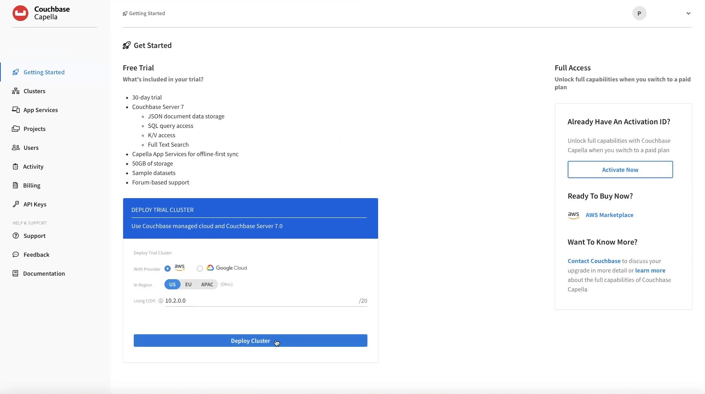
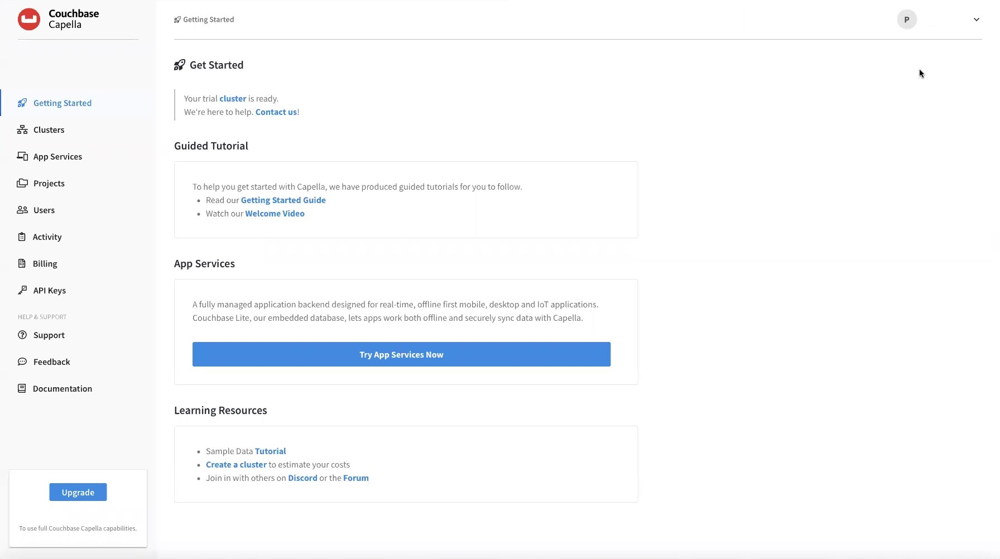
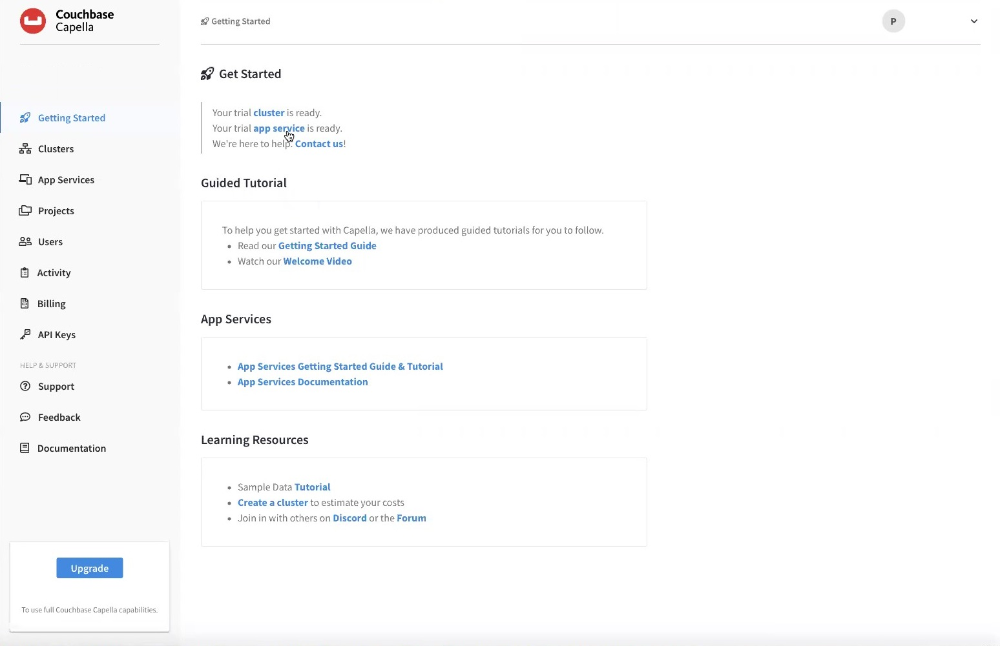

= Creating Free Account & Cluster
:page-topic-type: tutorial
:description: You need to create a Couchbase Capella account to start using Capella to manage your data.

[abstract]
{description}

The easiest way to get started is with a Couchbase Capella Free Trial.

[NOTE]
====
* If you are starting a Sales Assisted or Proof-of-Concept account and you have been provided an Activation ID, first follow <<sign-up-free-trial>> on this page.
Next, on the <<getting-started,Getting Started>> page, click the btn:[Activate Now] button and add your Activation ID.

* If you've received an invitation to join Couchbase Capella from someone within your organization, refer to  <<sign-up-invitation>> below for instructions.
====

[#sign-up-free-trial]
== Sign Up for Your Free Trial

.  Go to https://cloud.couchbase.com/sign-up.
+
image::signing-up-ui-overview/1c.png[The sign-up page for the 30-day free trial of Couchbase Capella]

. Provide your account details.
Enter the following information to create your account:
+
* Full Name
* Email Address
* Password
+
[TIP]
====
Passwords have the following requirements:

* Contain at least eight characters
* Contain uppercase, number, and symbol characters
====
+
* Organization Name

. To be updated on offers, products, and services from Couchbase, review the https://www.couchbase.com/privacy-policy[Privacy Policy^] and click the checkbox.
+
. Review the https://www.couchbase.com/CapellaCSSA10192021[Terms of Service^].
+
. Click btn:[Get started] to accept the Terms of Service and create your account.
+
. Confirm your account.
+
Couchbase will send you an email asking you to verify your email address.
Once you click the verification link, your account is confirmed and you'll be able to sign into Couchbase Capella at https://cloud.couchbase.com/[cloud.couchbase.com].

[#getting-started]
== Deploying Your Cluster

After signing in, you'll be brought to a Getting Started page.

. Select your preferred region for the trial.
. Leave the CIDR block to the default.
. Click btn:[Deploy Now].

+
You are taken to another _Getting Started_ page.

. Couchbase Capella will proceed with automatically deploying the cluster.
+
NOTE: A cluster will generally take under 2 minutes to deploy.

=== Control Plane UI Overview

On the _Getting Started with Your Free Trial_ page, you will see three sections: 

* Guided Tutorial: A step-by-step guide and follow-along video to get you up to speed quickly.
* App Services: Deploy the free trial of Capella App Services. App Services is a fully managed application backend designed for mobile and edge applications.
* Learning Resources: Links to videos and more tutorials that will accelerate your learning.

On the left, you will see the main Capella navigation items like _Clusters_, _Projects_, and _Users_.

=== Deploy App Services Trial (for mobile developers)

Mobile and IoT developers use Capella App Services to sync data between Capella buckets and mobile or edge devices running https://docs.couchbase.com/couchbase-lite/current/index.html[Couchbase Lite], as well as to authenticate and manage mobile/edge users.

To deploy the App Services trial, click the blue “Try App Services Now” button under “App Services on the _Getting Started_ page.

An App Service takes just a few minutes to deploy. When completed you will see a notification in the _Getting Started_ page.

To configure your trial App Service, see Configuring App Services

Congratulations. You finished this part of the tutorial.

* Next Topic: https://docs.couchbase.com/tutorials/dbaas-self-service/cluster-and-data.html[Connecting to Your Database]
Need a trial account? — https://cloud.couchbase.com/sign-up[Sign up]

